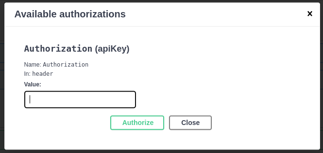

# Micro Streaming Application
The purpose of this application is to receive messages from a queue and process them. Afterwards, it saves the results to MongoDB.

## Requirements
1. **[Docker Desktop](https://www.docker.com/products/docker-desktop/)**
2. If you are working on Windows you will need to install [WSL](https://learn.microsoft.com/en-us/windows/wsl/install).

## Run services
Please proceed to the directory of the repository and execute the command `./msa-dev code-run`. Kindly remain patient until the message **'INFO: API has started in X seconds!'** is displayed on the terminal.

## Documentation of API

Before sending any requests, authorization is required. To obtain authorization, you must include the token "d05f06b5-61bc-4fc2-9aca-6adde3cacc56" in the headers. To do this, navigate to http://localhost:8080/swagger-ui/index.html and locate the "Authorize" button in the upper right corner. Paste the token into the provided window and then click the "Authorize" button.

Certainly, you can follow the instructions provided in the images below.



To mock the queue, you are required to send a POST request to http://localhost:8080/data_records/add_queue with the following JSON payload.
```json
{
  "version": "string",
  "device": "string",
  "path": "string",
  "trustedBoot": "string",
  "datastreams": [
    {
      "id": "string",
      "feed": "string",
      "datapoints": [
        {
          "from": 0,
          "at": 0,
          "value": 0
        }
      ]
    }
  ]
}
```

The API will aggregate all requests within a 30-second timeframe. Therefore, you are encouraged to send as many POST requests as possible within this 30-second window. Subsequently, after the 30-second interval elapses, the API will compute the statistics and persist them in MongoDB. If you wish to receive statistical results, you must send a GET request to http://localhost:8080/statistics. Optionally, you can filter the statistics using parameters such as StartDate, EndDate, Offset, and Limit. StartDate and EndDate denote data created within the specified date range in MongoDB. Offset and Limit facilitate pagination.If no parameters are provided, the default behavior is to return data created in the last 30 minutes in MongoDB. The Offset will be set to 0 and the Limit to 100. If there are more than 100 records, you will need to extract the "Link" key from the response header. This variable will contain the URL for the next page.


Below, you can find an example. If all records are able to fit in a response, you will observe the following response headers.


Additionally, here you can find the header response when all records do not fit on a single page.


To send requests from Swagger, please click on this [Link](http://localhost:8080/swagger-ui/index.html#) while the API is running.
